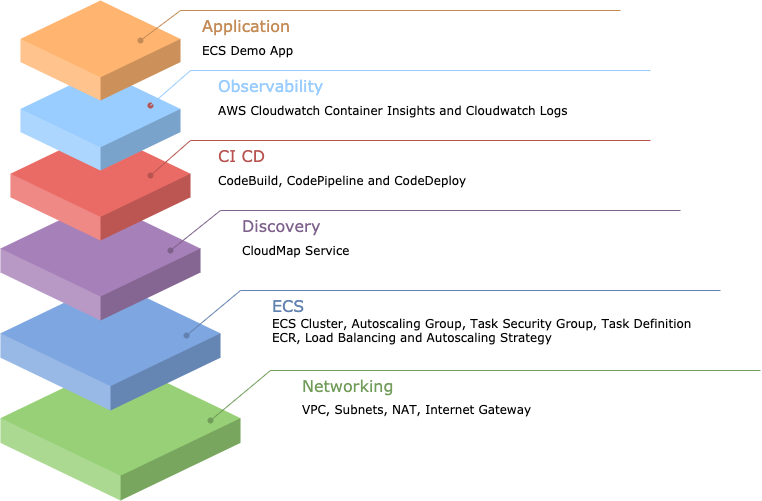
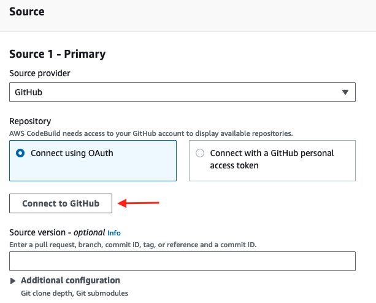
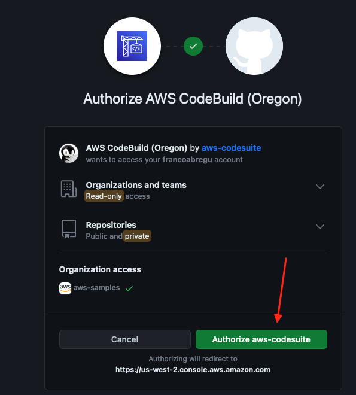
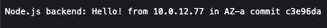
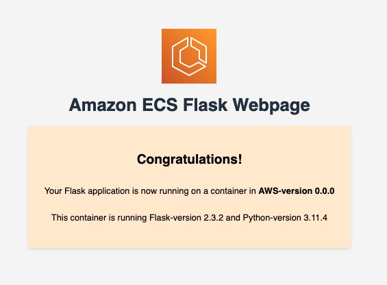
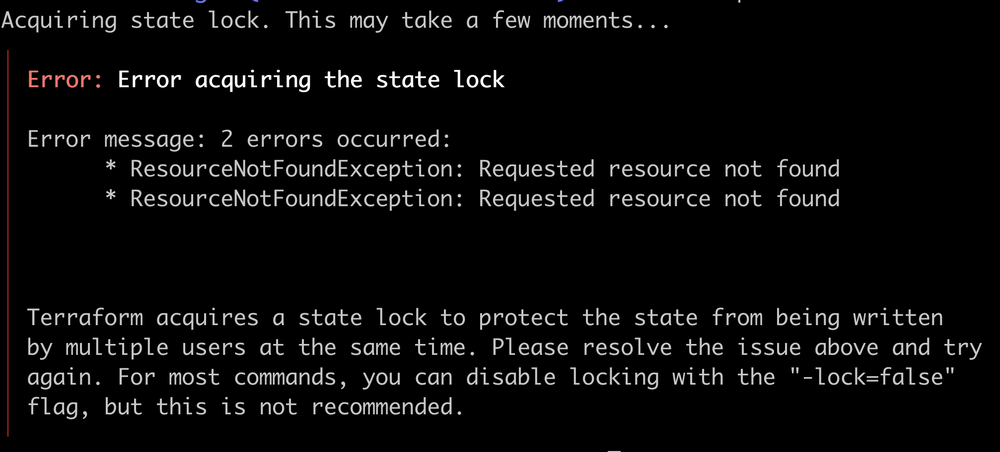

# Containers on ECS PMT Offering

During this engagement, AWS Professional Services will enable our customers to build a container environment based on the ECS service with best practices. Containers on ECS will cover key areas such as observability, CICD, discovery, ecs core and networking. This offer will include the necessary components to have a guide that will accelerate the process of preparing environments for a container architecture based on ECS.

## Foundation Module V1



## Pre-Requisites

### General

The pre-requisites for deploying this offering are the following:

* Dynamodb Table (A single DynamoDB table is used to lock multiple remote state files) 

In case you don't have it, use this CLI to create it:

```shell
  aws dynamodb create-table --table-name TerraformLockStates \
  --attribute-definitions AttributeName=LockID,AttributeType=S \
  --key-schema AttributeName=LockID,KeyType=HASH \
  --billing-mode PAY_PER_REQUEST --region us-east-1
```

That CLI will create a DynamoDB table on us-east-1 region with name TerraformLockStates and pay per request billing mode, the table will have a Hash Key called LockID

* S3 Bucket (Stores the state as a given key in a given bucket)
* [Terraform](https://developer.hashicorp.com/terraform/tutorials/aws-get-started/install-cli) 

In case you don't have it, use this CLI to create it:

```shell
  account_id=$(aws sts get-caller-identity --query "Account" --output text) && \
  aws s3api create-bucket --bucket ${account_id}-terraform-states \
  --region us-east-1 --output text --no-cli-pager && aws s3api put-bucket-versioning \
  --bucket ${account_id}-terraform-states --versioning-configuration Status=Enabled
```

That CLI will crete a private S3 Bucket with name AccountID-terraform-states with versioning enabled by default.

### Monitoring - Datadog integration module

The sensitive information for Datadog will be managed by AWS Secrets Manager, please create the following secret for the keys:

```shell
aws secretsmanager create-secret \
    --name datadog \
    --description "Datadog Secrets" \
    --secret-string "{\"datadog_api_key\":\"abc123.......\",\"datadog_app_key\":\"abc123........\"}"
```
- **datadog_api_key**: Should be the API Key created by your org on Datadog.
- **datadot_app_key**: Should be the Application Key created by your org on Datadog.

For more information about the Keys used by Datadog please check the [official docs.](https://docs.datadoghq.com/account_management/api-app-keys/)

### CI/CD - Github integration module

You need to first create an **AWS CodeStar** connection in your account to connect **Github** with **AWS**. Once you have it, create an **AWS SecretsManager** secret using the following command:

```shell
aws secretsmanager create-secret \
    --name github \
    --description "Github Secrets" \
    --secret-string "{\"code_star_connection_arn\":\"...Here....\",\"organization_name\":\"...Here....\"}"
```

- **code_star_connection_arn**: Should be the ARN of the Connection between AWS CodePipeline and GitHub.
- **organization_name**: Should be the name of the organization used for the integration.

For more information about the values of the variables check the official docs related to [create the connection.](https://docs.aws.amazon.com/codepipeline/latest/userguide/connections-github.html#connections-github-console)

Also, this module provides a way to run a github action from [GitHub Marketplace](https://github.com/marketplace?type=actions) using **AWS CodeBuild Github Actions Runner**. In order to configure the runner, you will need first to connect CodeBuild with github. Follow this steps to create a connection:

1. Go to CodeBuild console and select **create build project** 
2. Select github as Source and select connect to Github:



3. Accept the connection



4. Cancel the build project creation

Now your connection is available to use in any CodeBuild project. Just include any Github action in your **buildspec.yaml** and it will be able to use it.


For more details check this [guide](https://docs.aws.amazon.com/codebuild/latest/userguide/access-tokens.html#access-tokens-github)

Also, some github actions can use public images as source causing the following error:

```
toomanyrequests: You have reached your pull rate limit. You may increase the limit by authenticating and upgrading: https://www.docker.com/increase-rate-limit"
```

To avoid this, the module authenticates the steps using a dockerhub account. You will need to create a secret for the dockerhub credentials. Run the following command to create it:

```shell
aws secretsmanager create-secret \
    --name /apps/docker/credentials \
    --description "Github Secrets" \
    --secret-string "{\"username\":\"...Here....\",\"password\":\"...Here....\"}"
```

## Folder structure

The project has the following folder structure:
 
* **foundation**: Base code for a simple ECS cluster with an example application (Python), alerts and CICD configuration.
	* **application_code**: Example application for ECS Service, includes Python App (Flask, html), Dockerfile, Task Definition and Unit Tests.
	* **terraform**: Infrastructure As Code section.
		* **cicd**: This folder uses the "code_pipeline_python" and "s3" module (explained later in this section) to create the deployment lifecycle of an application.
		* **ec2**: Base code to deploy an ECS Cluster with EC2 (for a Fargate cluster search for the module).
			* **ecs-core**: This terraform module deploys an ECS Cluster, a Service Discovery private DNS namespace, autoscaling configuration and cluster alerts (using the cluster_alerts module)
			* **ecs-service**: This terraform module deploys an ECS Service, service discovery service and a service ALB.
    * **integrations**: Base code to deploy Github and Datadog Integrations.
      * **datadog**: The Datadog provider is used to interact with the resources supported by Datadog.
      * **github**: Github source is used to build and deploy application from Github repository.
    * **modules**: Base modules for the ECS Cluster.
      * **cluster_alerts**:  This modules deploys CloudWatch Metrics for the cluster, this creates 4 alarms with configurable thresholds:	
        * CPU Reservation Alarm.
        * CPU Utilization Alarm.
        * Memory Reservation Alarm.
        * Memory Reservation Alarm.
      * **code_pipeline_python**: This module deploys CodePipeline, CodeBuild resources for a CICD Pipeline and all the necessary IAM resources to create this.
      * **s3**: This module creates an S3 bucket (with best security practices all public access blocked) to be used in the CICD Pipeline of the application. 
  * **images**: images for documentation purposes.
  * **root files**: root file configuration for gitlab pipelines, gitignore files and pre-commit configurations.

## Getting started

To make it easy for you to get started with Containers on ECS PMT Offering, here's a list of next steps.

### Configure Backend

Go to **/foundation/terraform/** and modify the following files:

* ec2/ecs-core/**backend.tf**
* ec2/ecs-service/**backend.tf**
* cicd/**backend.tf**
* integrations/datadog/**backend.tf**
* integrations/github/**backend.tf**
  

and replace the **bucket name** and **dynamodb_table**, if your region is different than us-east-1 also change **region**

```
terraform {
  backend "s3" {
    bucket         = "${account_id}-terraform-states" <--- here
    ...
    region         = "us-east-1" <--- here if your region is different than us-east-1
    dynamodb_table = "TerraformLockStates" <--- here
  }
}
```

### Configure Environment

Before start, please define all values, go to the followings files and customize the values for your preferences.

* **/foundation/terraform/ec2/ecs-core/terraform.tfvars** 
* **/foundation/terraform/ec2/ecs-service/terraform.tfvars** 
* **/foundation/terraform/cicd/terraform.tfvars** 
* **/foundation/terraform/integrations/datadog/terraform.tfvars** 
* **/foundation/terraform/integrations/github/terraform.tfvars** 


### Deployment order

Is important that the commands are executed in the following order:

1. Deploy ECS Core
2. Deploy ECS Service
3. Deploy Application (CI CD)
4. Deploy Application Github Example (Integrations Github)
5. Deploy Datadog Integration

### Deploy ECS Core

Go to **/foundation/terraform/ec2/ecs-core** and run the following command:

```shell
terraform init
terraform validate
terraform plan #Here check the plan that Terraform outputs in case you want to change something.
terraform apply --auto-approve
```

### Deploy ECS Service

Go to **/foundation/terraform/ec2/ecs-service** and run the following command:

```shell
terraform init
terraform validate
terraform plan #Here check the plan that Terraform outputs in case you want to change something.
terraform apply --auto-approve
```

### Deploy Application's Pipeline

Go to **/foundation/terraform/cicd** and run the following command:

```shell
terraform init
terraform validate
terraform plan #Here check the plan that Terraform outputs in case you want to change something.
terraform apply --auto-approve
```

Check the section [Deploy Sample Application](#deploy-sample-application) to create the Repository and deploy a new version of the FrontEnd page.
### Deploy Github Example

Go to **/foundation/terraform/integrations/github/** and run the following command:

```shell
terraform init
terraform validate
terraform plan #Here check the plan that Terraform outputs in case you want to change something.
terraform apply --auto-approve
```

### Deploy Datadog Integration

Go to **/foundation/terraform/integrations/datadog/** and run the following command:

```shell
terraform init
terraform validate
terraform plan #Here check the plan that Terraform outputs in case you want to change something.
terraform apply --auto-approve
```

### Outputs
After the execution of the Terraform code you will get an output with needed IDs and values needed as input for the following *terraform apply*. You can use this infrastructure to run other examples, all you need is the `cluster_name`.

### Check Deployment Status
On the ECS Console you will find the **ecs-core** cluster, in it there will be a service called **ecsdemo-backend**, this service has an Application Load Balancer associated, you can execute the command **terraform output** on the **ecs-service** path and it will show the URL of the ALB, once you open that URL in a web browser it will show the following sample page:



If you keep refreshing the page it will show a different IP address and Availability Zone to demonstrate the Load Balancing.

### Deploy Sample Application

On the path **foundation/application_code/ecsdemo-python** there is a Dummy Repository with a Flask application, create a CodeCommit Repository named **ecs-offering-python-app** and push the content of that directory, the CodePipeline pipeline **ecs-offering-python-app-pipeline** will be executed after the push to the main branch, from there you can see the CI/CD pipeline with 3 stages: Security, CodeValidation and Deployment. If your deployment is successfull the Application LoadBalancer URL will show a page like the following:




### Cleanup
Run the following command if you want to delete all the resources created before. If you have created other blueprints and they use these infrastructure then destroy those blueprint resources first.

Go to **/foundation/terraform/integrations/datadog/** and run the following command:
```shell
terraform destroy
```

Go to **/foundation/terraform/integrations/github/** and run the following command:
```shell
terraform destroy
```

Go to **/foundation/terraform/cicd** and run the following command:
```shell
terraform destroy
```

Is possible that the deletion of the S3 Bucket associated with the CodePipeline pipeline fails because is not empty, hence please delete manually the objects in it and execute the command again.

Go to **/foundation/terraform/ec2/ecs-service** and run the following command:
```shell
terraform destroy
```
Go to **/foundation/terraform/ec2/ecs-core** and run the following command:

Delete ECR Container Images and ECR Repository
```shell
./delete_ecr_images.sh us-east-1 ecs-core
```

```shell
terraform destroy
```

Is possible that the deletion of the ECR Repository fails because there are images left on the repository, hence please delete manually the images and execute the command again.

Delete secrets immediately, in case of schedule for deletion change the parameter ```--force-delete-without-recovery``` to ```--recovery-window-in-days 7```

```shell
aws secretsmanager delete-secret \
    --secret-id datadog \
    --force-delete-without-recovery
```

```shell
aws secretsmanager delete-secret \
    --secret-id github \
    --force-delete-without-recovery
```

```shell
aws secretsmanager delete-secret \
    --secret-id /apps/docker/credentials \
    --force-delete-without-recovery
```

Delete Dynamodb Table (**NOTE**: Remember to the disable deletion protection):

```shell
aws dynamodb delete-table \
    --table-name TerraformLockStates
```

Delete S3 Bucket (**NOTE**: Remember first to emtpy the S3 Bucket):

```shell
account_id=$(aws sts get-caller-identity --query "Account" --output text)
aws s3api delete-bucket --bucket ${account_id}-terraform-states --region us-east-1
```

## Troubleshooting

### Error: Error acquiring the state lock

Error message: 2 errors occurred:
* ResourceNotFoundException: Requested resource not found
* ResourceNotFoundException: Requested resource not found



#### Solution

Create DynamoDB Table on **backend.tf** to store state lock (terraform.backend.dynamodb_table).
